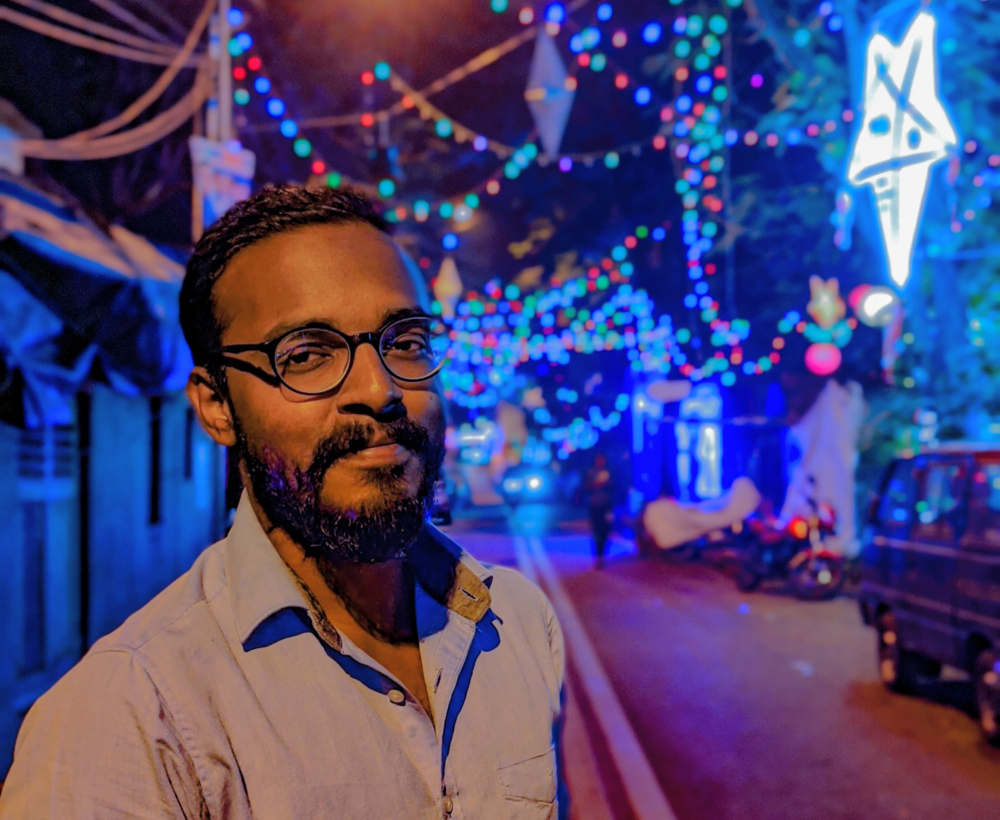

---
hide:
  - navigation
  - toc
---

# Hey there!

<!--
-->
<!---->
<!--I'm Yeshwanth. I'm an AI/ML Researcher from Chennai, India. I'm presently based out of Nicosia, Cyprus and work at <a href="https://cyens.org.cy/">CYENS CoE</a> as a <a href="https://cyens.org.cy/personnel/yeshwanth-kumar-adimoolam/">Research Associate</a> in the Visual Computing Group. I'm also a <a href="https://www.cut.ac.cy/faculties/aac/mga/degrees/doctoral.studies/doctoral-students/YESHWANTH+KUMAR+ADIMOOLAM/?languageId=1">doctoral research student</a> at the Cyprus University of Technology.-->
<!---->
<!--My research primarily focuses on developing deep neural network architectures for 3D urban scene understanding, which involves solving several challenging tasks such as 3D/2D segmentation, object detection, building footprint extraction, indoor reconstruction, etc.-->
<!---->
<!--
-->
<!-- -->
<!--<h3>Stuff I know:</h3>-->
<!---->

{ width=300 align=left } 

I'm Yeshwanth. I'm an AI/ML Researcher from Chennai, India. I'm presently based out of Nicosia, Cyprus and work at [CYENS CoE](https://cyens.org.cy/) as a [Research Associate](https://cyens.org.cy/personnel/yeshwanth-kumar-adimoolam/) in the Visual Computing Group. I'm also a [doctoral research student](https://www.cut.ac.cy/faculties/aac/mga/degrees/doctoral.studies/doctoral-students/YESHWANTH+KUMAR+ADIMOOLAM/?languageId=1) at the Cyprus University of Technology.

My research primarily focuses on developing deep neural network architectures for 3D urban scene understanding, which involves solving several challenging tasks such as 3D/2D segmentation, object detection, building footprint extraction, indoor reconstruction, etc.

Stuff I know: 

 

<!---->
<!---->

-   :fontawesome-regular-paper-plane:{ .lg .middle } __Contact__

    ---

    Feel free to reach out to me via email or on one of my socials. Checkout the footer for more links.

    [:fontawesome-regular-envelope: ](mailto:staryesh@gmail.com)
    [:fontawesome-brands-linkedin-in: ](https://www.linkedin.com/in/ykadimoolam95)
    [:simple-github: ](https://github.com/yeshwanth95)

-   :material-file-document-multiple-outline:{ .lg .middle } __Publications__

    ---

    Checkout some of my recent publications and preprints.

    [:octicons-arrow-right-24: Publications](publications.md)

-   :fontawesome-regular-keyboard:{ .lg .middle } __Projects__

    ---

    Have a look at some of my past work and hobby projects.

    [:octicons-arrow-right-24: Projects](projects/index.md)

-   :material-face-man-outline:{ .lg .middle } __About me__

    ---

    For more info about me...

    [:octicons-arrow-right-24: Details](about.md)

