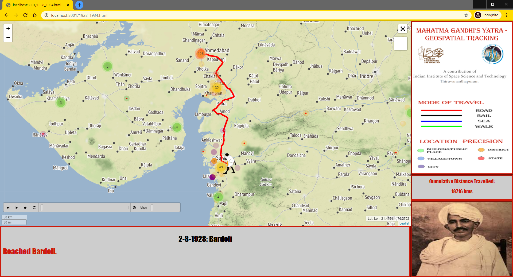

  
  <!-- -->
  

    <h1>Chronological Itinerary of Mahatma Gandhi's Travels using Folium and Leaflet</h1>
    <button class="md-button" onclick="window.open('https://youtu.be/gl8p2LB7e1Q','_blank')">Video</button>
  

This project was carried out during my Master's degree, in order to commemorate the 150th birth anniversary of Mahatma Gandhi. The main objective of this project was to create a web-based interactive geospatial application capable of tracking and visualising the lifelong travels of Mahatma Gandhi with as much spatiotemporal precision as possible.

The data for the travels of Mahatma Gandhi was manually retrieved from several sources such as biographies, news articles, etc. and compiled into a dataframe. After this, the geolocation of the various locations was carried and records with erroneous coordinates were corrected. Then, the means of travel between one location to the next was determined by using a combination of network analysis and contextual editing of some travel routes. Finally, the web application was created using Folium and Leaftlet, in addition to custom HTML, CSS and JS.

Upon completion of this project, I learned the basics of JavaScript, HTML and CSS. This project also gave me valuable insights in using several open geospatial libraries in Python and the data preparation required for those libraries.
A video demonstrating the final output can be found [here](https://youtu.be/gl8p2LB7e1Q).

<figure markdown="span">
  
  <!--<figcaption>Image caption</figcaption>-->
</figure>

<figure markdown="span">
  
  <!--<figcaption>Image caption</figcaption>-->
</figure>

<figure markdown="span">
  
  <!--<figcaption>Image caption</figcaption>-->
</figure>

<figure markdown="span">
  
  <!--<figcaption>Image caption</figcaption>-->
</figure>
