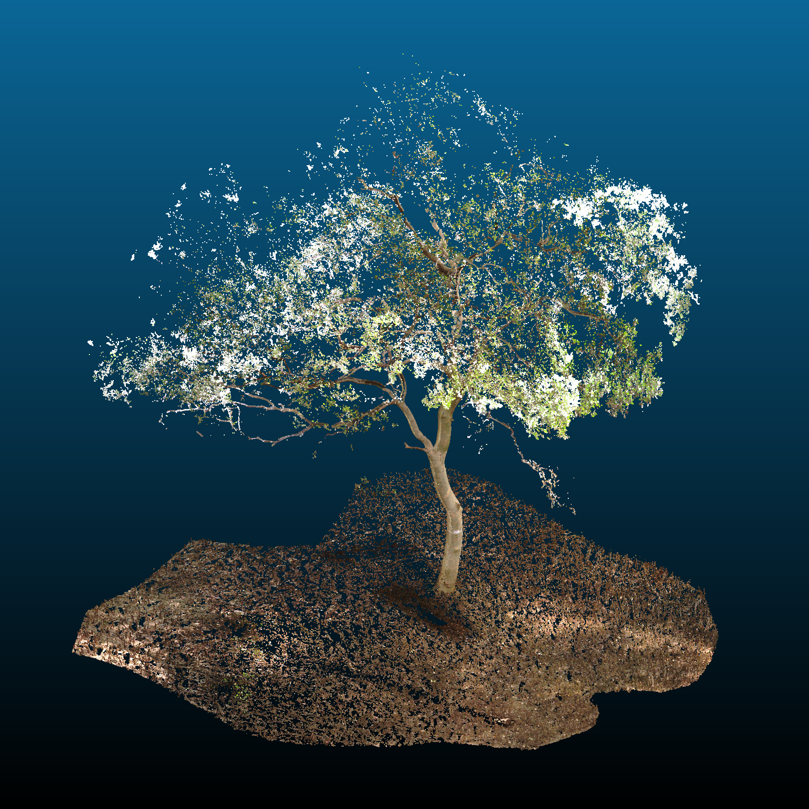
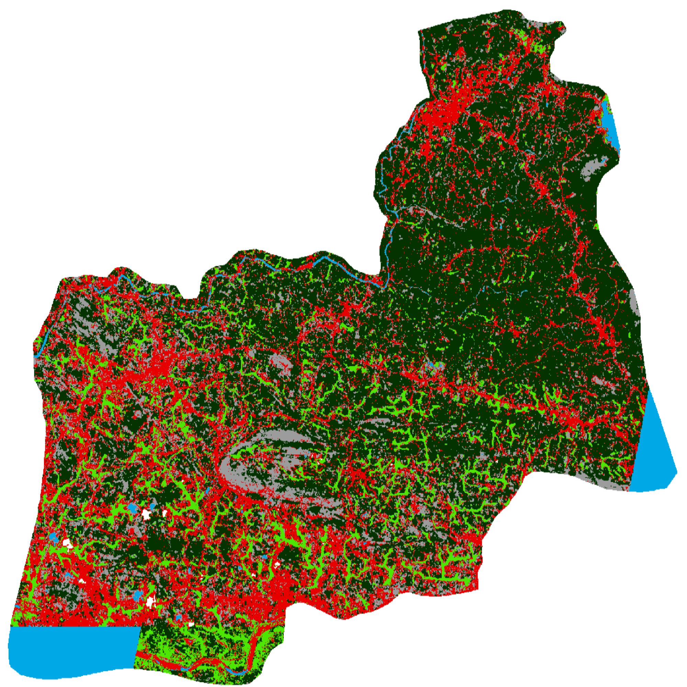
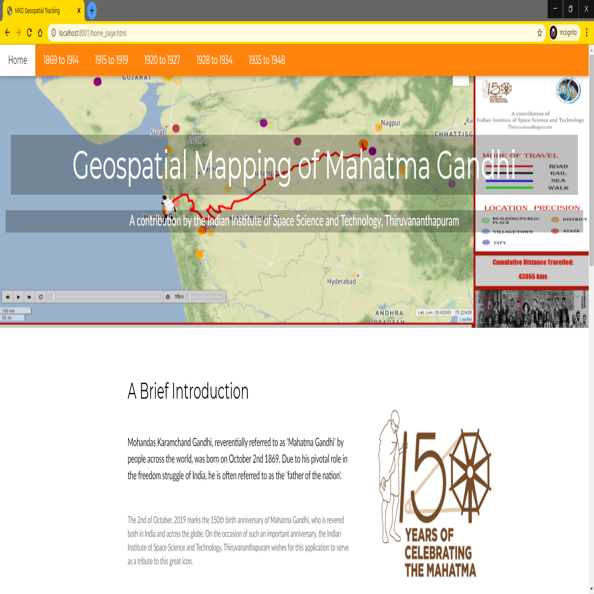

# Projects

---
### [Estimation of Tree Volumes from TLS Point Clouds](tree_biomass.md)

This study was carried out as part of my master's thesis research. The primary objective of this project was to make accurate estimates of above-ground tree volumes both at individual tree and plot levels. The area of study for this project was the mangrove forests in Thane, Maharashtra. The primary mode of data acquisition was in situ surveys of individual trees and 32m x 32m forest plots using the FARO Focus S350 terrestrial laser scanner. 

 

---
### [3D Visualisation and Digital Documentation of the IIST Library from Terrestrial LiDAR scans](iist_library.md)

This project involved digitally scanning, documenting and visualising the multi-storey library of the IIST, Trivandrum. The library was chosen as the object for documentation owing to it being a landmark structure of the IIST campus. In this study, the FARO Focus S350 terrestrial laser scanner was used to conduct the LiDAR surveys. After completion of the survey, the collected point cloud data was transferred to the Remote Sensing Lab for further processing. Finally, I used Potree - an open source WebGL-based point cloud renderer to visualise the results.

 

---
### [Estimation of Arable Area for the Kanjirappuzha Irrigation Project](kpip_irrigation.md)

During an outreach programme in collaboration with the Irrigation Design and Research Board (IDRB) of the Government of Kerala, I worked on estimating the cultivated/cultivable area in the command region of the Kanjirappuzha Irrigation Project.

 

---
### [Chronological Itinerary of Mahatma Gandhi's Travels](gandhi_project.md)

I worked on this project during my Master's degree, to commemorate the 150th birth anniversary of Mahatma Gandhi. The main objective of this project was to create a web-based interactive geospatial application capable of tracking and visualising the lifelong travels of Mahatma Gandhi with as much spatiotemporal precision as possible.

 
