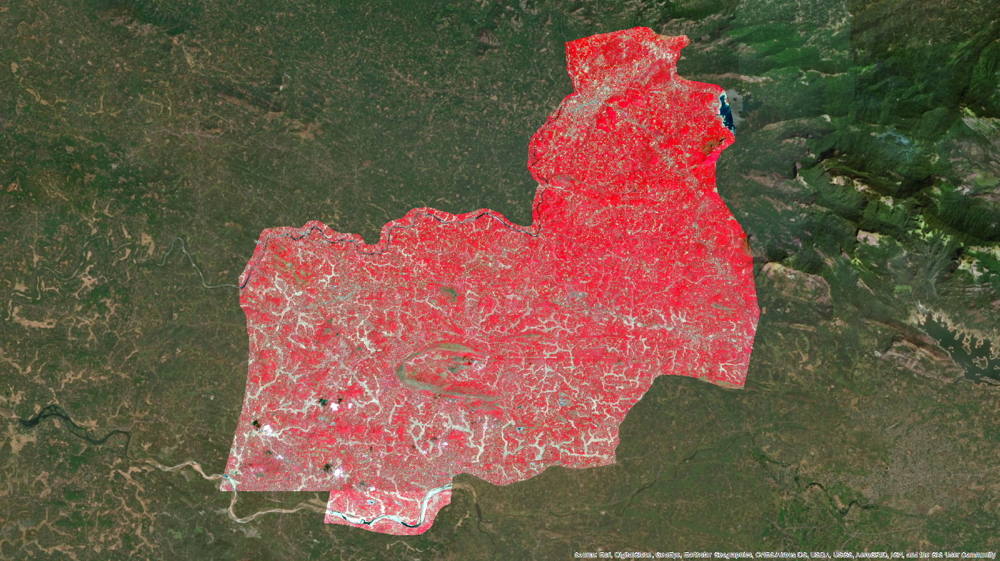
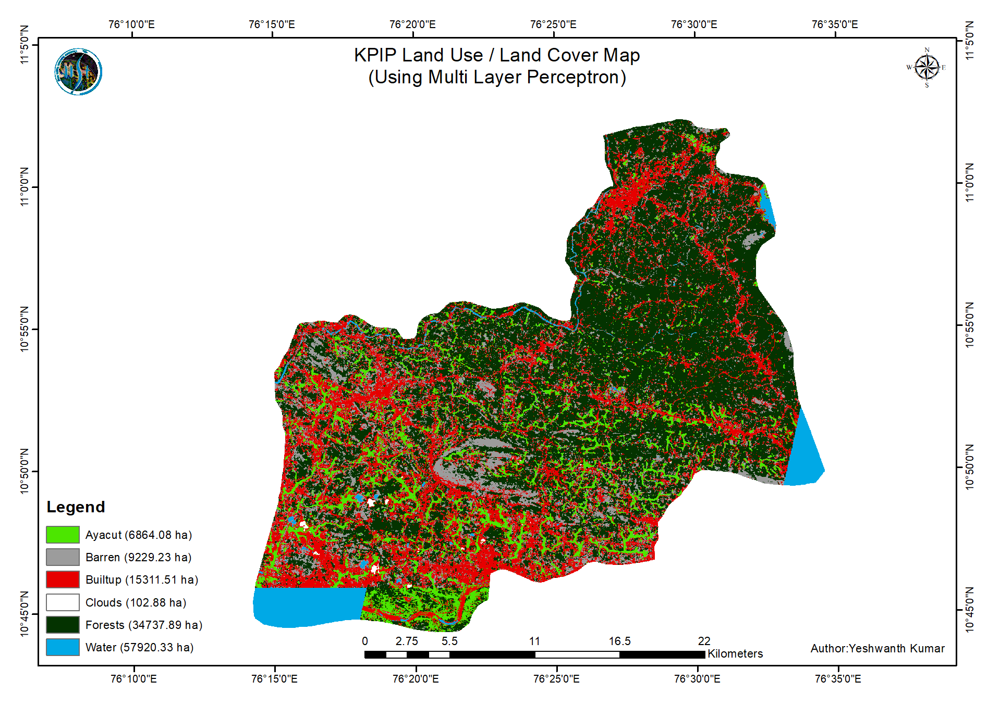

  
  <!-- -->
  

    <h1>Estimation of Cultivated/Cultivable (Ayacut) Area for the Kanjirappuzha Irrigation Project</h1>
    <button class="md-button" onclick="window.open('http://dx.doi.org/10.13140/RG.2.2.10734.64326','_blank')">Technical Report</button>
  

This project was carried out as part of an outreach programme to the Irrigation Design and Research Board (IDRB) of the Government of Kerala. In this project, the primary objective was to calculate the ayacut area (cultivated & cultivable area) in the command region of the Kanjirappuzha Irrigation Project.

Working on this project, I gained crucial experience in coordinating with the engineers of IDRB and ensuring that the data products met the requirements of the decision-makers. Furthermore, I was also able become familiar with the standard workflow followed by governmental GIS technicians. This outreach programme also involved training the IDRB GIS technicians regarding the various sources of open remote sensing data and state-of-the-art processing techniques.

Consequently, the project was completed as per the requirements and the results were submitted to the IDRB. A version of the report can be found [here](http://dx.doi.org/10.13140/RG.2.2.10734.64326).

<figure markdown="span">
  
  <figcaption>Study Area - Sentinel-2 imagery of the command region of the Kanjirappuzha Irrigation Project.</figcaption>
</figure>

<figure markdown="span">
  
  <figcaption>Land use / Land cover classification of the study area.</figcaption>
</figure>
