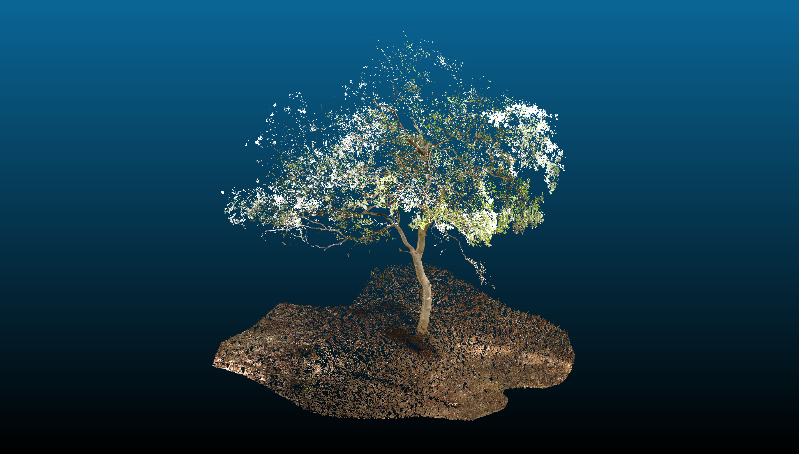

  
  <!-- -->
  

    <h1>Estimation of Tree Volumes from Terrestrial LiDAR Point Clouds</h1>
    <button class="md-button" onclick="window.open('https://www.preprints.org/manuscript/202210.0190/v1','_blank')">Paper</button>
  

This study was carried out as part of my master's thesis research. The primary objective of this project was to make accurate estimates of above-ground tree volumes both at individual tree and plot levels. The area of study for this project was the mangrove forests in Thane, Maharashtra. The primary mode of data acquisition was in situ surveys of individual trees and 32m x 32m forest plots using the FARO Focus S350 terrestrial laser scanner.

In this project, a weighted random forest classifier was used to perform foliage filtration. Geometric features were calculated at different scales for each point and passed as inputs for the classifier. After foliage filtration, existing state-of-the-art methods were implemented to construct quantitative structure models (QSMs) from the foliage filtered point clouds, from which the above-ground volume of trees was accurately estimated.

At the end of this study, in addition to meeting the objectives of the research, I had gained substantial proficiency in planning and conducting TLS surveys of forests, registration & preprocessing of LiDAR data, computing normals & geometric features of point clouds, point-wise classification of point clouds, etc.

<figure markdown="span">
  
  <!--<figcaption>Image caption</figcaption>-->
</figure>

<figure markdown="span">
  
  <!--<figcaption>Image caption</figcaption>-->
</figure>

<figure markdown="span">
  
  <!--<figcaption>Image caption</figcaption>-->
</figure>

<figure markdown="span">
  
  <!--<figcaption>Image caption</figcaption>-->
</figure>

<figure markdown="span">
  
  <!--<figcaption>Image caption</figcaption>-->
</figure>
