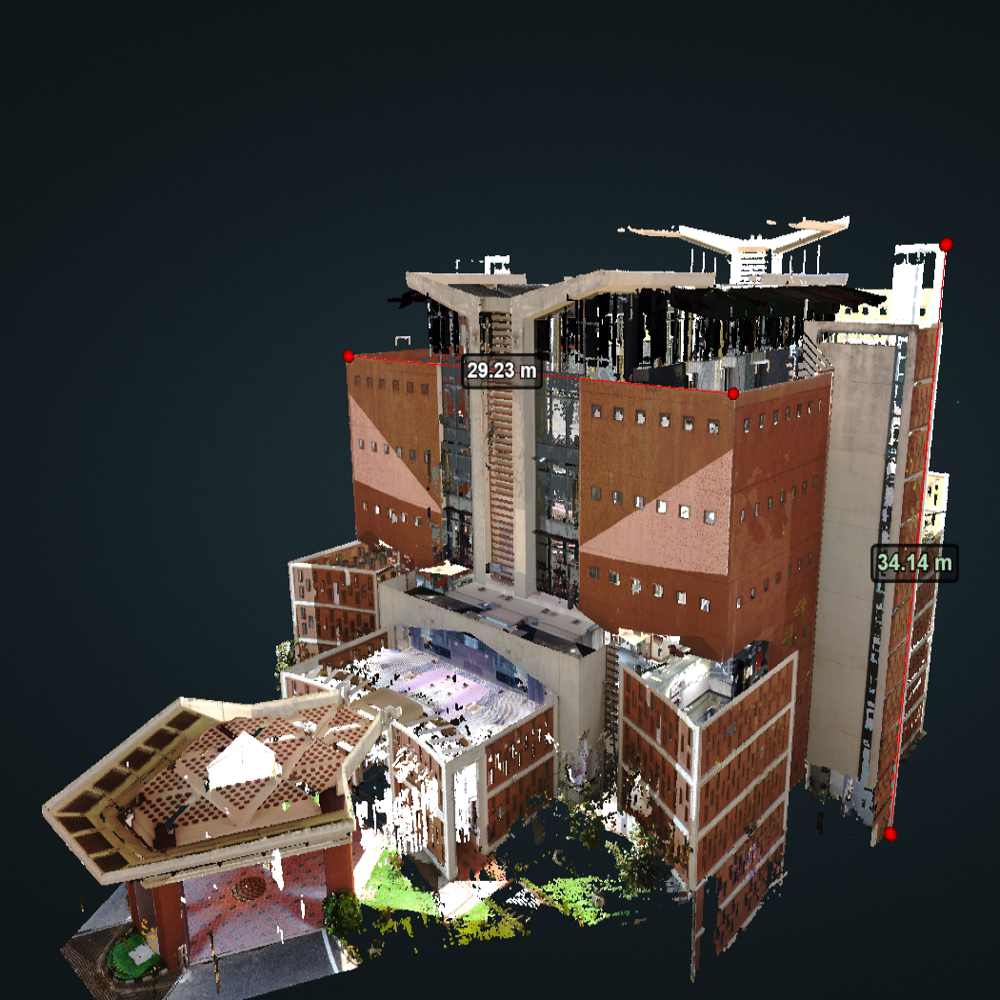

# Publications

<!------->
<!--THIS IS A PUBLICATION ENTRY TEMPLATE-->
<!--
-->
<!--  -->
<!--   -->
<!--  
-->
<!--    <strong>Paper title</strong> -->
<!--    Authors list, Doe, J. -->
<!--    <em>Journal title</em>2023 -->
<!--    <button onclick="window.open('#','_blank')">ABS</button>-->
<!--    <button onclick="window.open('','_blank')">PDF</button>-->
<!--    <button onclick="window.open('','_blank')">CODE</button>-->
<!--    <button onclick="window.open('','_blank')">PROJECT PAGE</button>-->
<!--  
-->
<!--
-->
<!-- -->

## 2025

---

  
   
  

    <strong>Pix2Poly: A Sequence Prediction Method for End-to-end Polygonal Building Footprint Extraction</strong> 
    Adimoolam, Y. K., Poullis, C., Averkiou, M. 
    <em>In Proc. WACV, 2025 (Accepted for publication)</em> 
    <button class="md-button" onclick="window.open('https://arxiv.org/abs/2412.07899','_blank')">ABS</button>
    <button class="md-button" onclick="window.open('https://arxiv.org/pdf/2412.07899','_blank')">PDF</button>
    <button class="md-button" onclick="window.open('https://github.com/yeshwanth95/Pix2Poly','_blank')">CODE</button>
    <button class="md-button" onclick="window.open('https://yeshwanth95.github.io/Pix2Poly','_blank')">PROJECT PAGE</button>
  

 

## 2023

---

  
   
  

    <strong>Efficient deduplication and leakage detection in large scale image datasets with a focus on the crowdai mapping challenge dataset</strong> 
    Adimoolam, Y. K., Chatterjee, B., Poullis, C., Averkiou, M. 
    <em>arXiv preprint arXiv:2304.02296, 2023</em> 
    <button class="md-button" onclick="window.open('https://arxiv.org/abs/2304.02296','_blank')">ABS</button>
    <button class="md-button" onclick="window.open('https://arxiv.org/pdf/2304.02296','_blank')">PDF</button>
    <button class="md-button" onclick="window.open('https://github.com/yeshwanth95/crowdai_hash_and_search','_blank')">CODE</button>
    <button class="md-button" onclick="window.open('https://datainspector.app','_blank')">PROJECT PAGE</button>
  

 

## 2022
---

  
   
  

    <strong>Estimation of Above Ground Volume of Mangrove Forest Trees from Terrestrial LiDAR Data using Supervised Machine Learning Algorithms</strong> 
    Yeshwanth Adimoolam, Nithin D. Pillai, Gnanappazham Lakshmanan, Deepak Mishra, Vinay Kumar Dadhwal 
    <em>Preprints, 2022</em> 
    <button class="md-button" onclick="window.open('https://www.preprints.org/manuscript/202210.0190/v1','_blank')">ABS</button>
    <button class="md-button" onclick="window.open('https://www.preprints.org/manuscript/202210.0190/v1','_blank')">PDF</button>
  

 

## 2019
---

  
   
  

    <strong>Building Information Modelling of a Multi Storey Building using Terrestrial Laser Scanner and Potree: An Open Source Point Cloud Renderer</strong> 
    Adimoolam, Y. K., Noufia, M. A., Shahira, K. A., A. M. Ramiya 
    <em>The International Archives of the Photogrammetry, Remote Sensing and Spatial Information Sciences, 2019</em> 
    <button class="md-button" onclick="window.open('https://isprs-archives.copernicus.org/articles/XLII-2-W17/421/2019','_blank')">ABS</button>
    <button class="md-button" onclick="window.open('https://isprs-archives.copernicus.org/articles/XLII-2-W17/421/2019/isprs-archives-XLII-2-W17-421-2019.pdf','_blank')">PDF</button>
  

 

<!--**Efficient deduplication and leakage detection in large scale image datasets with a focus on the crowdai mapping challenge dataset** -->
<!--Adimoolam, Y. K., Chatterjee, B., Poullis, P., Averkiou, M. -->
<!--*arXiv preprint arXiv:2304.02296* -->
<!--[ABS](){ .md-button }-->
